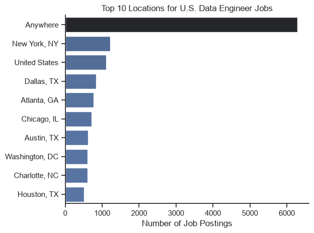
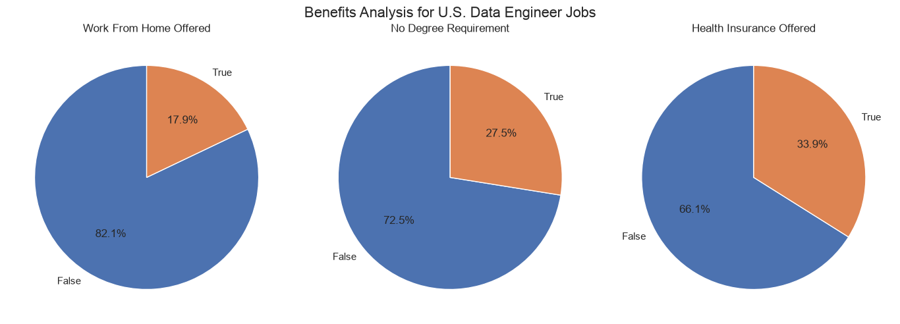
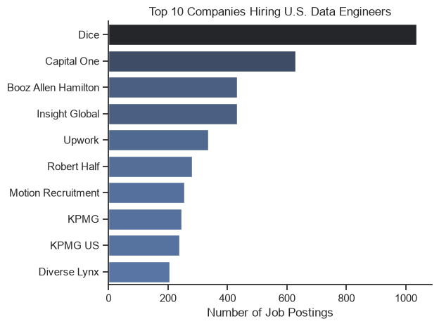
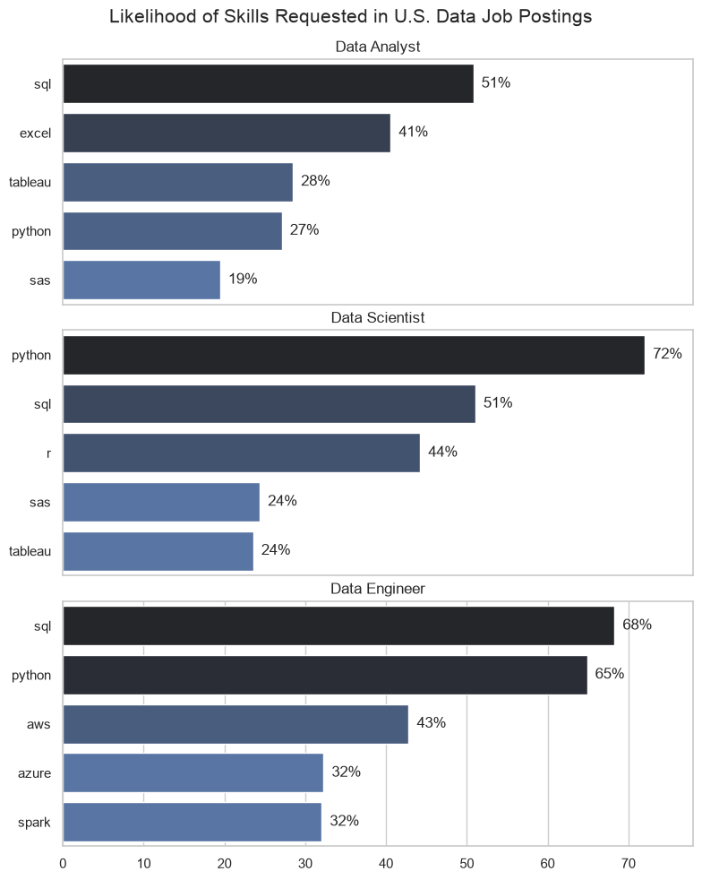
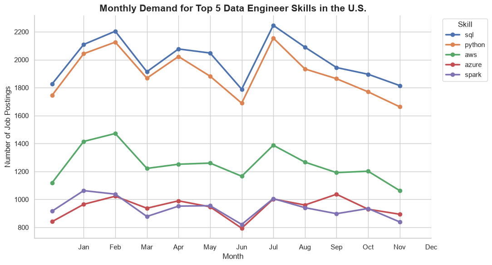
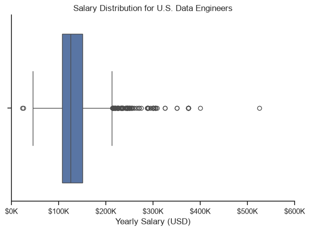
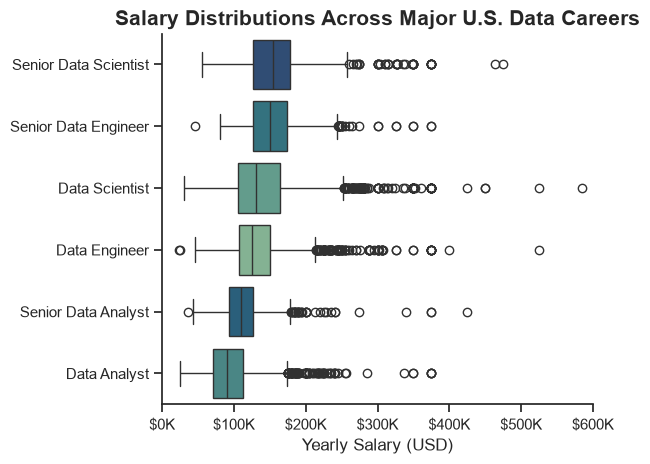
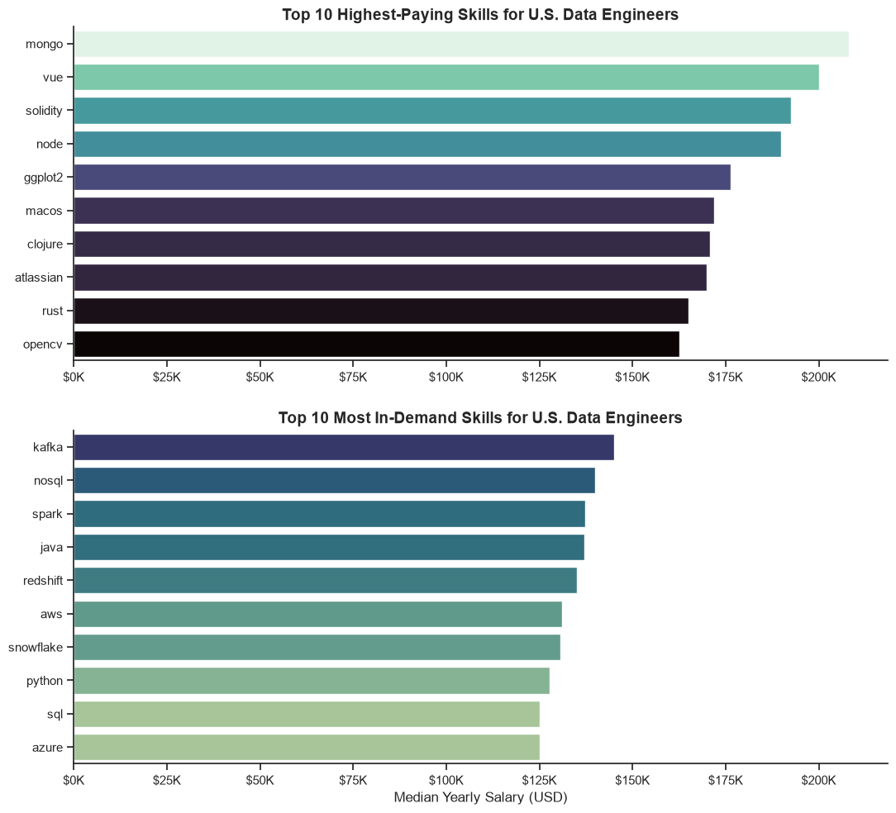
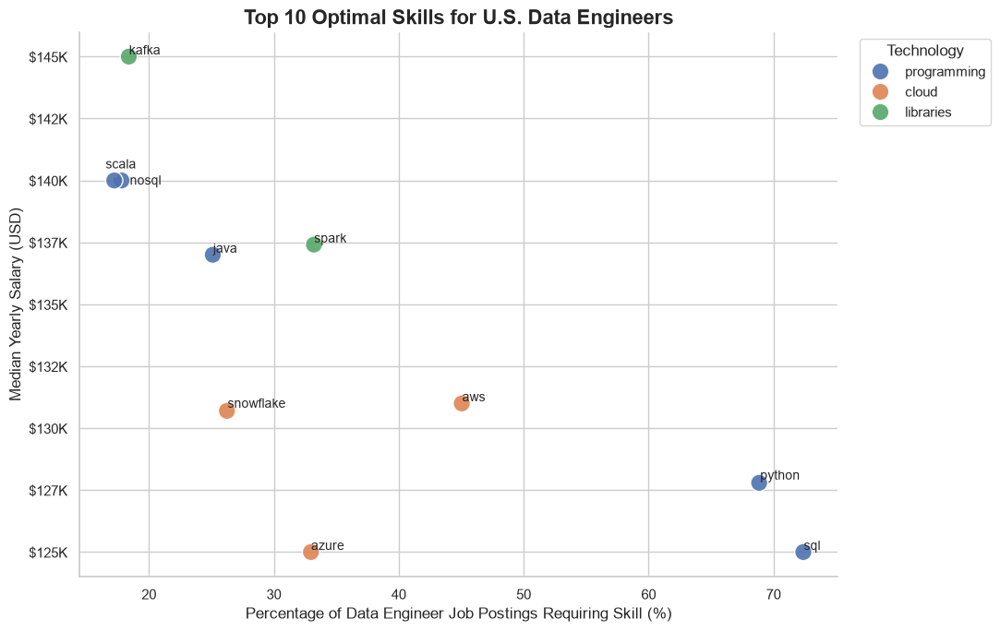

# U.S. Data Engineering Job Market Analysis

## Overview


This project analyzes the U.S. data job market using Python, with a primary focus on **Data Engineering** roles. The goal is to transform job-posting data into actionable insights about the technical skills employers demand, how those skills trend over time, and how they relate to compensation.

Rather than looking only at raw job counts, I approached the project as a decision-making problem: **Which skills provide the strongest combination of market demand and salary potential for a Data Engineer?**

I also compare Data Engineering with adjacent roles such as Data Analyst, Data Scientist, Senior Data Engineer, and Senior Data Scientist to better understand how technical requirements and compensation change across the broader data ecosystem.

The project demonstrates an end-to-end analytics workflow using **Python, Pandas, NumPy, Matplotlib, Seaborn, and Jupyter Notebooks**, including data cleaning, transformation, exploratory analysis, aggregation, time-series analysis, salary analysis, and data visualization.


## Business Questions

This analysis focuses on four questions:

1. **Which technical skills are most in demand across major data roles, and how does Data Engineering compare?**
2. **How does demand for key Data Engineering skills change throughout the year?**
3. **How do salaries vary across data roles, and which skills are associated with higher Data Engineer compensation?**
4. **Which Data Engineering skills provide the strongest combination of job-market demand and median salary?**


## Tools & Technical Skills

### Python
Used as the primary language for data cleaning, transformation, analysis, and visualization.

### Data Analysis
- **Pandas** — filtering, aggregation, grouping, reshaping, exploding nested skill data, and DataFrame operations
- **NumPy** — numerical operations and missing-value handling
- **Python standard libraries** — data parsing and transformation

### Data Visualization
- **Matplotlib** — customized charts, axis formatting, annotations, and multi-panel visualizations
- **Seaborn** — statistical visualizations including bar plots, line plots, box plots, and scatter plots
- **adjustText** — dynamic annotation placement for crowded scatter plots

### Analytical Techniques
- Exploratory Data Analysis (EDA)
- Data cleaning and transformation
- Categorical analysis
- Time-series trend analysis
- Salary distribution analysis
- Median-based compensation analysis
- Skill-demand normalization
- Multi-dimensional demand vs. salary analysis

### Development & Version Control
- Jupyter Notebooks
- Visual Studio Code
- Git
- GitHub


## Data Preparation and Cleanup

Before analyzing the U.S. Data Engineering job market, I prepared the dataset so the fields could be used consistently across the project.

The main preparation steps were:

- Loaded the job-posting dataset into a Pandas DataFrame
- Converted `job_posted_date` into datetime format
- Parsed `job_skills` into usable Python lists
- Filtered the dataset to **U.S. Data Engineer** job postings
- Used copies of filtered DataFrames to avoid modifying the original dataset

```python
# Import libraries
import ast
import pandas as pd
import seaborn as sns
import matplotlib.pyplot as plt
from datasets import load_dataset

# Load dataset
dataset = load_dataset("lukebarousse/data_jobs")
df = dataset["train"].to_pandas()

# Clean date and skill columns
df["job_posted_date"] = pd.to_datetime(df["job_posted_date"])

df["job_skills"] = df["job_skills"].apply(
    lambda x: ast.literal_eval(x) if pd.notna(x) else x
)

# Filter for U.S. Data Engineer jobs
df_DE_US = df[
    (df["job_title_short"] == "Data Engineer") &
    (df["job_country"] == "United States")
].copy()
```

This cleaned DataFrame became the foundation for the exploratory analysis, skill-demand analysis, trend analysis, salary analysis, and optimal-skills analysis that follow.


## Analysis

### 1. Exploratory Data Analysis of U.S. Data Engineer Jobs

I started with an exploratory analysis of the U.S. Data Engineering job market to understand **where jobs are concentrated, what employment conditions appear in postings, and which companies are hiring most actively**.

This provides the broader market context for the skill-demand, salary, and optimal-skills analyses that follow.

[View the full EDA notebook →](1_EDA_Intro.ipynb)

#### Key Analysis Code

The dataset was filtered to U.S. Data Engineer positions before analyzing locations, benefits, and hiring companies.

```python
# Filter for U.S. Data Engineer jobs
df_DE_US = df[
    (df["job_title_short"] == "Data Engineer") &
    (df["job_country"] == "United States")
]

# Top locations
top_locations = df_DE_US["job_location"].value_counts().head(10)

# Benefits / job characteristics
benefit_columns = [
    "job_work_from_home",
    "job_no_degree_mention",
    "job_health_insurance"
]

benefits = df_DE_US[benefit_columns].mean() * 100

# Top hiring companies
top_companies = df_DE_US["company_name"].value_counts().head(10)
```

> The complete cleaning, transformation, and visualization code is available in the linked notebook.

#### Top Locations for U.S. Data Engineer Jobs



**Key takeaways:**
- A large share of postings are categorized as **"Anywhere"**, indicating substantial location flexibility within the dataset.
- Among named locations, **New York, Dallas, Atlanta, Chicago, Austin, Washington D.C., Charlotte, and Houston** appear as notable Data Engineering markets.
- Opportunities are geographically distributed across several major U.S. business and technology hubs.

#### Benefits and Job Requirements



**Key takeaways:**
- **17.9%** of postings explicitly indicate that work-from-home is offered.
- **27.5%** indicate that a degree is not required.
- **33.9%** explicitly mention health insurance.
- These percentages represent attributes explicitly identified in the dataset and should not be interpreted as universal employer policies.

#### Top Companies Hiring U.S. Data Engineers



**Key takeaways:**
- **Dice** has the highest posting volume in the dataset, followed by **Capital One**.
- Consulting, staffing, financial-services, and technology-oriented organizations all appear among the leading sources of Data Engineering opportunities.
- The employer mix demonstrates that demand for Data Engineering extends beyond traditional technology companies.

---

### 2. Which Skills Are Most in Demand Across Major Data Roles?

Next, I compared skill demand across three major data occupations:

- Data Analyst
- Data Scientist
- Data Engineer

Rather than comparing raw skill counts alone, I calculated the **percentage of job postings within each occupation that requested each skill**. This accounts for differences in the total number of postings across roles.

[View the full Skills Count notebook →](2_Skills_Count.ipynb)

#### Key Analysis Code

The core analysis expands each posting's skill list, counts skills by occupation, and calculates how frequently each skill appears relative to the total number of jobs for that role.

```python
# Expand skills into individual rows
df_skills = df.explode("job_skills")

# Count skills by job title
df_skills_count = (
    df_skills
    .groupby(["job_title_short", "job_skills"])
    .size()
    .reset_index(name="skill_count")
)

# Count total postings for each role
df_job_count = df["job_title_short"].value_counts()

# Calculate percentage of postings requesting each skill
df_skills_count["skill_percent"] = df_skills_count.apply(
    lambda row: 100 * row["skill_count"] / df_job_count[row["job_title_short"]],
    axis=1
)
```

> The complete filtering, ranking, plotting, and formatting code is available in the linked notebook.

#### Skill Demand Across Data Roles



**Key takeaways:**
- **SQL is foundational across all three roles**, appearing in approximately **51% of Data Analyst**, **51% of Data Scientist**, and **68% of Data Engineer** postings.
- **Python becomes increasingly important in technical roles**, appearing in approximately **72% of Data Scientist** and **65% of Data Engineer** postings.
- Data Analysts show stronger demand for business-facing tools such as **Excel (41%)** and **Tableau (28%)**.
- Data Scientists show greater demand for statistical and programming tools, particularly **Python (72%)** and **R (44%)**.
- Data Engineers have a more infrastructure-oriented skill profile, with **AWS (43%)**, **Azure (32%)**, and **Spark (32%)** appearing alongside SQL and Python.

#### Why This Matters

The comparison shows that **SQL and Python provide highly transferable foundations across the data ecosystem**, while specialized skills differ substantially by role.

For Data Engineering specifically, the results point toward a core combination of **SQL, Python, cloud platforms, and distributed data-processing technologies**.

This provides the foundation for the next analysis: determining **how demand for these Data Engineering skills changes over time**.

### 3. How Is Demand for Data Engineering Skills Changing Over Time?

After identifying the most commonly requested Data Engineering skills, I analyzed how demand for these technologies changed throughout the year.

I grouped U.S. Data Engineer job postings by month and tracked the five leading skills: **SQL, Python, AWS, Azure, and Spark**. This helps distinguish skills with consistently strong demand from those whose demand fluctuates more throughout the year.

[View the full Skills Trend notebook →](3_Skills_Trend.ipynb)

#### Key Analysis Code

The core analysis groups skill occurrences by month to track how frequently each technology appears in Data Engineer job postings over time.

```python
# Group skills by month
df_DE_US["job_posted_month_no"] = df_DE_US["job_posted_date"].dt.month

df_skills_trend = (
    df_DE_US
    .explode("job_skills")
    .groupby(["job_posted_month_no", "job_skills"])
    .size()
    .unstack()
)

# Select the top Data Engineer skills
top_skills = ["sql", "python", "aws", "azure", "spark"]

df_skills_trend[top_skills].plot(
    marker="o"
)
```

> The complete data preparation, skill ranking, and visualization code is available in the linked notebook.

#### Monthly Demand for Top Data Engineer Skills



**Key takeaways:**

- **SQL and Python consistently dominate demand**, remaining the two most frequently requested Data Engineering skills throughout the year.
- **AWS forms a clear second tier**, with demand remaining below SQL and Python but substantially above most other infrastructure technologies.
- **Azure and Spark show similar levels of demand**, with both generally appearing in fewer postings than AWS.
- Skill demand moves somewhat together across months, suggesting that part of the variation reflects changes in **overall Data Engineer hiring activity**, rather than major shifts in the relative importance of individual technologies.
- Despite monthly fluctuations, the overall ranking remains relatively stable: **SQL → Python → AWS → Azure/Spark**.

#### Why This Matters

The trend analysis suggests that Data Engineering employers consistently prioritize a core technical stack rather than rapidly changing their skill requirements.

For someone targeting Data Engineering roles, **SQL and Python provide the strongest foundation**, while cloud and distributed-processing technologies such as **AWS, Azure, and Spark** provide important complementary skills.

This leads into the next analysis: **how compensation varies across data roles and Data Engineering skills**.

### 4. How Does Compensation Vary Across Data Careers and Data Engineering Skills?

After analyzing skill demand, I examined compensation to understand both the overall salary distribution for U.S. Data Engineers and how Data Engineering compares with other major data careers.

I then analyzed median salaries by skill to identify which technologies are associated with higher-paying Data Engineering opportunities.

[View the full Salary Analysis notebook →](4_Salary_Analysis.ipynb)

#### Salary Distribution for U.S. Data Engineers

I first examined the distribution of yearly salaries specifically for U.S. Data Engineer positions.

```python
sns.boxplot(
    x=df_DE_US["salary_year_avg"]
)

plt.title("Salary Distribution for U.S. Data Engineers")
plt.xlabel("Yearly Salary (USD)")
plt.xlim(0, 600000)

plt.show()
```



**Key takeaways:**

- Most Data Engineer salaries are concentrated roughly around the **$100K–$150K range**.
- The median salary sits near the center of this range, indicating strong overall compensation for Data Engineering roles.
- The distribution is **right-skewed**, with a substantial number of high-paying positions above $200K.
- A small number of extreme observations extend beyond $300K and even $500K, showing the presence of exceptionally high-compensation opportunities.

---

#### Salary Distributions Across Major U.S. Data Careers

Next, I compared Data Engineering compensation with several related data occupations to understand where the role sits within the broader data career market.

```python
job_order = [
    "Senior Data Scientist",
    "Senior Data Engineer",
    "Data Scientist",
    "Data Engineer",
    "Senior Data Analyst",
    "Data Analyst"
]

sns.boxplot(
    data=df_US_top6,
    x="salary_year_avg",
    y="job_title_short",
    order=job_order
)

plt.title("Salary Distributions Across Major U.S. Data Careers")
plt.xlabel("Yearly Salary (USD)")
plt.ylabel("")
plt.show()
```



**Key takeaways:**

- **Senior Data Scientists and Senior Data Engineers** occupy the highest salary ranges among the careers compared.
- Data Engineers generally earn more than Data Analysts and are competitive with Data Scientists.
- Moving from Data Engineer to **Senior Data Engineer** produces a visible upward shift in compensation.
- Every occupation contains high-paying outliers, demonstrating substantial salary variation even within the same job category.
- Overall, Data Engineering provides a strong compensation path with additional upside as experience and seniority increase.

---

#### Which Data Engineering Skills Are Associated With Higher Salaries?

Finally, I compared skills from two perspectives:

- the skills associated with the **highest median salaries**, and
- the **most in-demand skills** and their corresponding median salaries.

```python
df_DE_skills = (
    df_DE_US
    .dropna(subset=["salary_year_avg"])
    .explode("job_skills")
)

df_DE_skills_pay = (
    df_DE_skills
    .groupby("job_skills")["salary_year_avg"]
    .agg(["count", "median"])
)

df_DE_skills_pay = df_DE_skills_pay[
    df_DE_skills_pay["count"] > 0
]
```



**Key takeaways:**

- Some specialized technologies are associated with very high median salaries, but many appear less frequently in Data Engineering postings.
- **Mongo, Vue, Solidity, and Node** appear among the highest-paying skills in the dataset, although high salary alone does not necessarily indicate broad employer demand.
- Among more commonly requested Data Engineering technologies, **Kafka, NoSQL, Spark, Java, Redshift, AWS, and Snowflake** combine strong demand with relatively high median salaries.
- Core technologies such as **Python and SQL** remain highly relevant even though their median salaries are below some more specialized technologies.
- This highlights an important distinction: the **highest-paying skill is not necessarily the most valuable skill to learn** if relatively few employers request it.

#### Salary Analysis Summary

The salary analysis shows that Data Engineering offers strong compensation relative to other major data careers, with additional salary growth at the senior level.

More importantly, salary and demand should be considered together. Some niche technologies command very high median salaries but appear in relatively few job postings, while established Data Engineering technologies offer a stronger combination of **market demand and compensation**.

This creates the basis for the final analysis: identifying the **optimal Data Engineering skills to learn based on both salary and demand**.

### 5. What Are the Most Optimal Skills for U.S. Data Engineers?

Finally, I combined **skill demand and median salary** to identify which technologies offer the strongest opportunities for U.S. Data Engineers.

Rather than looking only at the highest-paying skills, this analysis considers how frequently each skill appears in Data Engineer job postings. This provides a more practical view of which technologies combine strong compensation with real employer demand.

[View the full Optimal Skills notebook →](5_Optimal_Skills.ipynb)

#### Identifying High-Value Data Engineering Skills

For each skill, I calculated:

- **Skill Demand (%)** — the percentage of U.S. Data Engineer job postings requesting the skill.
- **Median Salary** — the median yearly salary associated with postings requesting that skill.
- **Technology Category** — grouping skills into programming, cloud, and library technologies.

The resulting scatter plot compares salary and demand simultaneously.

```python
# Calculate skill demand as a percentage of Data Engineer postings
df_DE_skills["skill_percent"] = (
    df_DE_skills["skill_count"] / len(df_DE_US) * 100
)

# Keep the most relevant skills
df_plot = df_DE_skills[
    df_DE_skills["skill_percent"] > skill_limit
]

# Compare demand and median salary
sns.scatterplot(
    data=df_plot,
    x="skill_percent",
    y="median_salary",
    hue="technology"
)

plt.xlabel("Percentage of Data Engineer Job Postings Requiring Skill (%)")
plt.ylabel("Median Yearly Salary (USD)")
plt.title("Top 10 Optimal Skills for U.S. Data Engineers")

plt.show()
```

> The complete data preparation, salary calculations, skill categorization, and visualization code is available in the linked notebook.

#### Optimal Skills for U.S. Data Engineers



**Key takeaways:**

- **SQL and Python dominate employer demand**, appearing in roughly 70% or more of Data Engineer postings in the analysis.
- **Python provides slightly higher median compensation than SQL**, while both remain foundational skills because of their exceptionally high demand.
- **AWS offers one of the strongest demand-to-salary combinations**, appearing in roughly 45% of postings while maintaining a median salary around $131K.
- **Spark stands out as a strong specialized skill**, combining a median salary around $137K with demand above 30%.
- **Kafka has the highest median salary among the displayed skills**, around $145K, despite appearing in a much smaller share of postings.
- **Scala and NoSQL also show relatively high median salaries**, but with substantially lower demand than Python, SQL, or AWS.
- **Azure and Snowflake** occupy the middle of the market, offering meaningful demand with median compensation around the $125K–$131K range.

#### Final Insight

There is no single "best" Data Engineering skill based on salary alone.

The analysis suggests a practical skill strategy:

**Foundation → SQL + Python**

These technologies provide the broadest access to Data Engineering opportunities because they dominate employer demand.

**Cloud → AWS**

AWS provides a strong combination of market demand and compensation, making cloud expertise an important complement to the core programming stack.

**Data Processing → Spark**

Spark offers higher median compensation while maintaining meaningful employer demand.

**Specialization → Kafka / Scala / NoSQL**

These technologies appear less frequently but are associated with higher median salaries, making them potentially valuable specialization skills after establishing the core Data Engineering stack.

Overall, the strongest Data Engineering skill portfolio is not simply the collection of technologies with the highest salaries. It is a combination of **high-demand foundational skills and higher-value specialized technologies**.

## What I Learned

This project strengthened my ability to move from raw job-posting data to structured, decision-oriented analysis using Python.

- **Advanced Python & Pandas:** Improved my ability to clean, transform, filter, explode, group, aggregate, and analyze larger datasets.
- **Data Cleaning & Preparation:** Worked with missing values, date transformations, nested skill data, salary fields, and job-specific filtering to prepare the dataset for analysis.
- **Exploratory Data Analysis:** Used EDA to understand the U.S. Data Engineering market before moving into more targeted questions around skills, trends, and compensation.
- **Data Visualization:** Used **Matplotlib and Seaborn** to build bar charts, line charts, box plots, pie charts, and scatter plots suited to different analytical questions.
- **Strategic Skill Analysis:** Learned how to combine multiple metrics—particularly **skill demand and median salary**—instead of evaluating technologies using a single measure.
- **Analytical Storytelling:** Structured separate analyses into a connected workflow that moves from understanding the market to producing practical career and hiring insights.

## Insights

The analysis highlighted several patterns within the U.S. Data Engineering job market:

- **SQL and Python form the foundation of Data Engineering demand**, appearing far more frequently than most other technologies.
- **AWS, Spark, Snowflake, Kafka, and other infrastructure technologies** provide important specialization opportunities beyond the core programming stack.
- Demand for the leading Data Engineering skills remained relatively consistent throughout the year, despite fluctuations in overall hiring activity.
- Data Engineering offers **strong compensation relative to several other major data careers**, with additional upside at senior levels.
- The highest-paying skills are not necessarily the most widely requested, making it important to evaluate **salary and market demand together**.
- A strong skill strategy therefore combines widely requested foundations such as **SQL and Python** with higher-value cloud, processing, and infrastructure technologies.

## Challenges I Faced

One of the biggest challenges was transforming the raw dataset into formats appropriate for different analyses. Skill data required exploding nested values, salary analysis required handling missing observations and outliers, and time-series analysis required restructuring job postings by month.

Another challenge was deciding **which metric actually answered each question**. Raw job counts, percentages, median salaries, and salary distributions each tell different stories. Working through these decisions helped me better understand that effective analytics is not only about writing Python code—it is about selecting the right method to answer the underlying question.

## Conclusion

This project showcases an end-to-end data analysis of the U.S. Data Engineering job market using **Python, Pandas, Matplotlib, Seaborn, and Jupyter Notebook**. I implemented data cleaning, transformation, exploratory analysis, aggregation, and visualization techniques to examine job-market trends across skills, compensation, employers, and hiring demand.

More importantly, the project demonstrated how data can be used to move beyond descriptive reporting and support practical decisions. By combining **market demand, skill trends, and compensation**, I was able to identify not only which technologies employers request, but which skills may provide the strongest combination of opportunity and value for Data Engineers.

Overall, the project demonstrates my ability to use Python-based analytics to transform raw data into structured analysis, clear visualizations, and decision-oriented data insights.